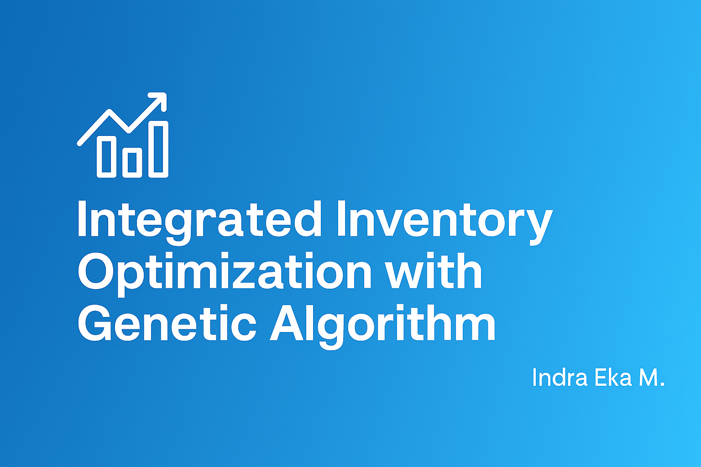

# 📦 Integrated Inventory Optimization using Genetic Algorithm (MATLAB)

This project implements an integrated inventory optimization model for **Single Vendor–Multiple Buyer** systems in the batik industry.  
It considers **imperfect quality**, **lead time reduction**, and **transportation cost** using a **Genetic Algorithm (GA)** approach, developed in **MATLAB R2020**.

---

---

## 🎯 Objective

- Optimize order quantity, lead time, and safety factor for each buyer
- Calculate shipment schedule and total expected cost for the vendor
- Integrate multiple constraints: demand variation, transportation cost, imperfect items
- Built for real-world application in batik manufacturing and retail distribution

---

## 📊 Inputs & Outputs

**Inputs (per buyer):**
- Demand rate
- Transportation cost
- Service level

**Outputs (per buyer):**
- Order quantity
- Lead time
- Safety factor
- Total Expected Cost (TEC)

**Outputs (for vendor):**
- Number of shipments
- Probability of stock out of control
- Vendor TEC & total JTEC

---

## 🚀 How to Run

1. Open in **MATLAB R2020**
2. Run `GUI.m`
3. Enter demand and logistics inputs for each buyer
4. Review GA optimization results and total cost outputs

---

## 👨‍💻 Author

**Indra Eka Mandriana S.Kom**  
_Optimization & Supply Chain Systems Researcher_

---

## ⭐ Found this helpful? Consider giving it a ⭐
